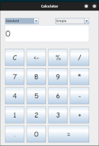
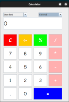
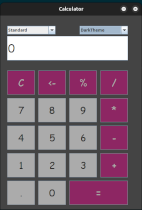

# Java Calculator Project

## Overview

This project is a simple Calculator developed using Java Swing. It also includes unit tests written with JUnit to validate the implementation logic of the calculator.





## Requirements

- Java 8+
- IDE: Eclipse or IntelliJ IDEA
- JUnit 5 Framework

## Project Configuration

### 1. Creating a Simple Maven Project

Let's name the project `Calculator` and add the JUnit 5 dependency below:

```xml
<dependency>
    <groupId>org.junit.jupiter</groupId>
    <artifactId>junit-jupiter-api</artifactId>
    <version>5.7.0</version>
    <scope>test</scope>
</dependency>
```
### 2. Calculator Implementation using Java Swing

Create a Java class called Calculator and add the following content to it:

```java
    // Calculator class code here
```

### 3. License

This project is licensed under the MIT License. See the [LICENSE](LICENSE) file for more details.

Luan Ferreira GitHub: [luanhsouzaf](https://github.com/luanferreiradev)
